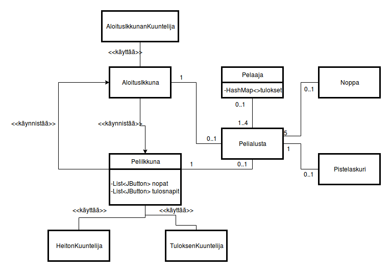

**AIHE:** Yatsi peli. Toteutetaan vuoropohjainen noppapeli, yatsi, jota voi
pelata yksin tai kavereiden kanssa (1-4 pelaajaa).

**Käyttäjät:** Kuka tahansa joka pelistä pitää

**Käyttäjien toiminnot:** 
- nimen valitseminen peliin
- nopan heitto
- säilytettävin noppien valitseminen
- pisteiden kohdistaminen johonkin tulokseen
**Rakennekuvaus**
Ohjelman logiikan pohjana toimii Pelialusta-luokka, joka sisältää listana 5 Noppa olioita, 1-4 Pelaaja olioita, joilla on nimi ja omat pisteensä tallennettuna, sekä Pistelaskurin jonka avulla pisteet lasketaan. MainClassina toimii AloitusIkkuna, joka avautuu kun ohjelma käynnistetään. AloitusIkkunassa luodaan Pelialusta ja siinä lisätään pelaajat alustalle kirjoittamalla nimi tekstikenttään. AloitusIkkunan kuuntelija-luokka määrittää ikkunassa olevien näppäinten toiminnot. AloitusIkkunasta käynnistetään PeliIkkuna, joka saa parametrinä luodun Pelialustan. PeliIkkunassa nopanheitto näppäintä painettaessa kutsutaan Pelialustan heitäNopat metodia, joka taas kutsuu jokaisen nopan heittometodia, joka arpoo nopalle luvun väliltä 1-6. PeliIkkunan noppanäppäimissä päivittyy jokaisen heiton jälkeen HeitonKuuntelija- luokan määritelmien mukaan noppien arvo pelialustasta, ja noppia painamalla kutsutaan noppien lukitsemismetodia, joka asettaa nopan heitettäväksi tai säästettäväksi. Tulosnapeilla asetetaan tulos taulukkoon TuloksenKuuntelija luokan avulla, joka saa pelialustasta vuorossa olevan pelaajan paikan taulukossa ja laskee painetun napin mukaisen tuloksen pelialustan pistelaskurilla ja asettaa sen pelaajan pistetaulukkoon. PeliIkkunalla on yhteys myös AloitusIkkunaan, sillä pelin loputtua nopanheittämis nappi käynnistää uuden AloitusIkkunan.

**Luokkakaavio**

**Sekvenssikaaviot**

Pelaajan lisääminen:

Nopan heitto sekvenssikaaviona:

